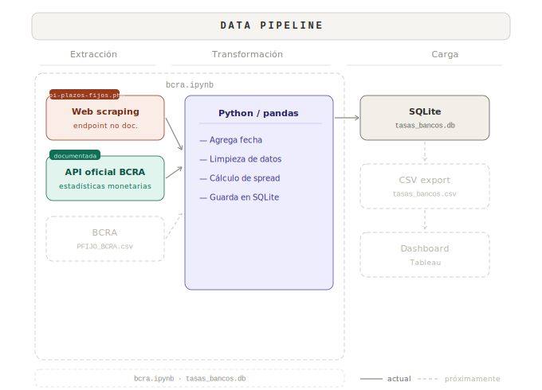

# 🏦 BCRA - Money Market Monitor

Seguimiento de tasas de Plazo Fijo 

## 📌 El problema que resuelve este proyecto

El **sistema financiero argentino** contiene **más de 70 entidades** que ofrecen *tasas de depósitos a plazo fijo* que cambian con frecuencia. Comparar esas tasas manualmente resulta **ineficiente** tanto para **inversores** como para **analistas**.

Este proyecto construye un **pipeline de datos** que extrae las tasas de depósitos **directamente del *Banco Central de la República Argentina (BCRA)*** y compara las ofertas de cada banco individual con la **tasa promedio ponderada del sistema financiero**.

El resultado es una **métrica derivada** llamada ***Investment Spread***, que permite identificar:

- bancos que ofrecen rendimientos por encima del mercado
- bancos que fijan tasas de depósitos por debajo del *benchmark* del sistema
- la competitividad relativa de cada banco dentro del mercado de depósitos

## 📊 Core Metric: *Investment Spread*

El **indicador central del proyecto** es el **spread entre la tasa de un banco y el benchmark del sistema financiero**.

### Fórmula

**Investment Spread = Tasa del plazo fijo del banco − Tasa promedio ponderada del sistema**

### Interpretación

| Spread | Significado |
|------|------|
| **> 0** | El banco ofrece **rendimientos por encima del promedio del mercado** |
| **< 0** | El banco ofrece **rendimientos por debajo del benchmark del sistema** |
| **≈ 0** | El banco está **alineado con el equilibrio del mercado** |

### Aplicación

Esta métrica permite a **inversores y analistas** identificar rápidamente:

- **bancos que pagan por encima del mercado**
- **bancos que pagan por debajo del promedio del sistema**
- **oportunidades relativas dentro del sistema bancario**

## 📊 ¿Por qué usar el *Benchmark* del Promedio Ponderado a 30 días?

El **BCRA** publica la **tasa promedio ponderada de depósitos del sistema financiero**, calculada utilizando el **volumen de depósitos de cada institución**.

Utilizar el **promedio ponderado** en lugar de un **promedio simple** permite obtener una **representación más precisa del precio del dinero en el mercado**.

| Criterio | Promedio Simple | ✅ Promedio Ponderado |
|---|---|---|
| **Representatividad** | Todos los bancos se tratan por igual | Ponderado por volumen de depósitos |
| **Sensibilidad a valores extremos** | Alta | Menor |
| **Señal de mercado** | Ruidosa | Refleja el precio real del mercado |

Este **benchmark** funciona entonces como un **precio de referencia de la liquidez dentro del sistema bancario argentino**.

## 🗂 Fuentes de datos

El proyecto integra **dos fuentes principales de datos financieros**.

| Fuente | Descripción |
|---|---|
| **[API Oficial del BCRA](https://www.bcra.gob.ar/apis-banco-central/)** | Tasa promedio ponderada de depósitos a plazo fijo del sistema financiero |
| **[Plazos Fijos Online (BCRA)](https://www.bcra.gob.ar/plazos-fijos-online/)** | Tasas de depósitos ofrecidas por bancos individuales |

## 🏗 Arquitectura de datos

El pipeline sigue una **arquitectura modular tipo ELT**

<p align="center">
  
</p> 

## 📁 Estructura del repositorio

```
BCRA-MONEY-MARKET-MONITOR/
│
├── .github/
│   └── workflows/
│       └── Daily ETL.yml
│           Workflow de GitHub Actions — ejecuta el ETL diario a las 22:22 ARG
│
├── Notebook/
│   └── bcra.ipynb
│       Exploración de datos, limpieza y desarrollo interactivo
│
├── SQL/
│   └── Top10bancos.sql
│       Consulta SQL para obtener los 10 bancos con mayor tasa de plazo fijo
│
├── ETL.py
│   Script de producción — extracción, transformación y carga incremental
│
├── tasas_bancos.db
│   Base de datos SQLite con tasas históricas (se actualiza diariamente)
│
└── README.md
```
 
## ⚙️ Data Pipeline — Automatización diaria

El pipeline se ejecuta automáticamente todos los días a las **22:22 (ART)** mediante **GitHub Actions**, garantizando una actualización consistente y sin intervención manual.

### 🔄 Flujo de ejecución

En cada corrida, el sistema:

- Extrae el **promedio ponderado del sistema financiero** desde la API oficial del BCRA  
- Obtiene las **tasas de plazo fijo por entidad**  
- Calcula el **Spread** de cada banco respecto al benchmark  
- Realiza una **carga incremental en SQLite**, con control de duplicados por fecha  
- Versiona automáticamente la base de datos mediante commit en el repositorio  

## 📍 Cobertura del Dataset

▓▓▓▓▓▓▓▓▓▓▓▓▓▓▓▓░░░░░░░░░░░░░░░░  
**30 / 70+ instituciones financieras (~43%)**

El MVP actual cubre a los **10 bancos con mayor volumen de depósitos del sistema financiero**, junto con otras entidades que **informaron al BCRA la tasa de plazo fijo ofrecida a no clientes**.


## 📊 Ejemplo de salida

Top 10 bancos por **tasa de plazo fijo a 30 días**, comparados contra el  
**promedio ponderado del sistema publicado por el BCRA**. (31/03/2026)

| Banco | Tasa PF 30 días (%) | Promedio BCRA (%) | Spread |
|------|------|------|------|
| BANCO MERIDIAN S.A. | 28.50 | 23.90 | 4.60 |
| CRÉDITO REGIONAL COMPAÑÍA FINANCIERA S.A.U. | 28.50 | 23.90 | 4.60 |
| BANCO VOII S.A. | 28.00 | 23.90 | 4.10 |
| BANCO CMF S.A. | 27.50 | 23.90 | 3.60 |
| BANCO BICA S.A. | 27.00 | 23.90 | 3.10 |
| REBA COMPAÑÍA FINANCIERA S.A. | 27.00 | 23.90 | 3.10 |
| BANCO DE LA PROVINCIA DE CORDOBA S.A. | 25.50 | 23.90 | 1.60 |
| BANCO DEL SOL S.A. | 25.50 | 23.90 | 1.60 |
| BANCO DE COMERCIO S.A. | 25.00 | 23.90 | 1.10 |
| BANCO DINO S.A. | 25.00 | 23.90 | 1.10 |

La tabla se obtiene mediante la siguiente consulta SQL sobre la base `tasas_bancos`:

```sql
SELECT 
       banco,
       tasa_pf_30d, 
       promedio_bcra,
       ROUND(spread,2) AS spread
FROM tasas_bancos
ORDER BY tasa_pf_30d DESC
LIMIT 10;
``` 
## ▶️  Cómo ejecutar el proyecto

**Clonar el repositorio:**


```bash
git clone https://github.com/yourusername/bcra-money-market-monitor
```
**Instalar dependencias:**

```pip install pandas requests```

**Ejecutar el notebook:**

```jupyter notebook Notebook/bcra.ipynb```

**Ejecutar las transformaciones SQL utilizando SQLite o cualquier entorno compatible con PostgreSQL.**


## 🗺 Roadmap


| Funcionalidad | Descripción |
|----------------|-------------|
| Ampliación de cobertura | Expandir el dataset a todas las instituciones financieras del BCRA |
| Dashboard interactivo | Visualización analítica del mercado de tasas en **Tableau** |
| Evolución de spreads | Análisis temporal de spreads respecto al benchmark del sistema |
| Competitividad bancaria | Monitoreo del posicionamiento relativo de bancos en el mercado de depósitos |
| Sistema de alertas | Notificaciones automáticas cuando el **spread supere un umbral configurable**, indicando potenciales oportunidades |
| Comparación con inflación | Evaluar si las tasas de plazo fijo **superan la inflación esperada** |

## 👤 Autor

**Giovanni Larosa**


Este proyecto forma parte de un portfolio enfocado en **pipelines de datos end-to-end aplicados al monitoreo del mercado financiero**.

- LinkedIn: https://www.linkedin.com/in/giovanni-larosa/
- GitHub: https://github.com/larosag 

## 📄 Licencia

MIT License